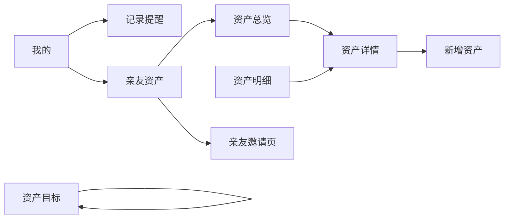
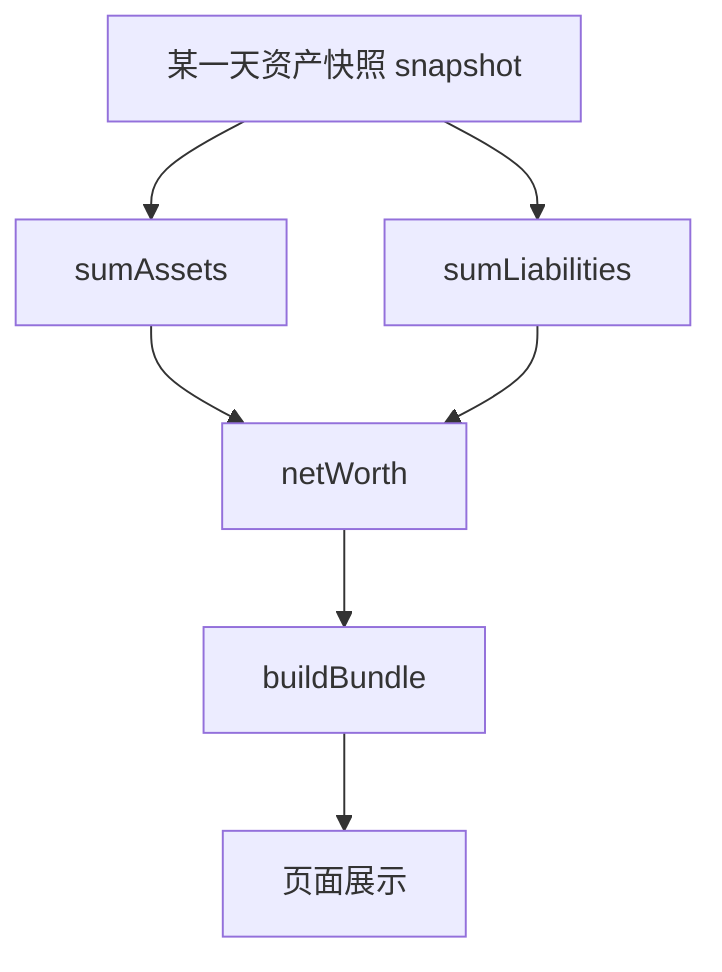
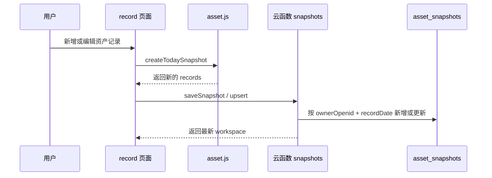
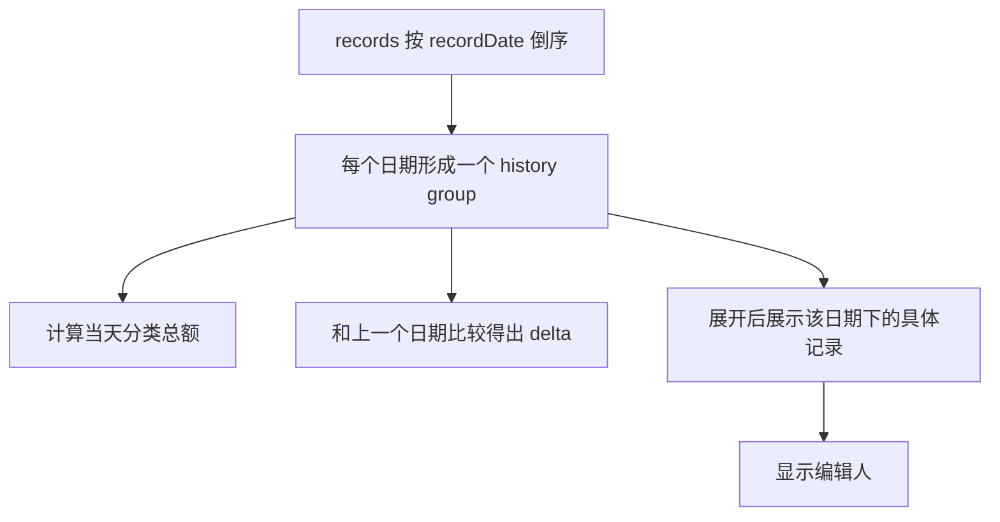
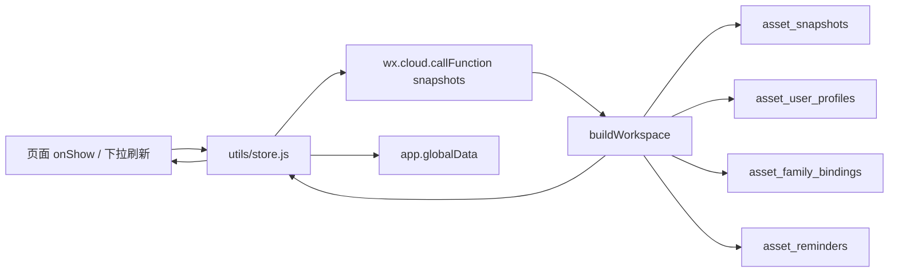
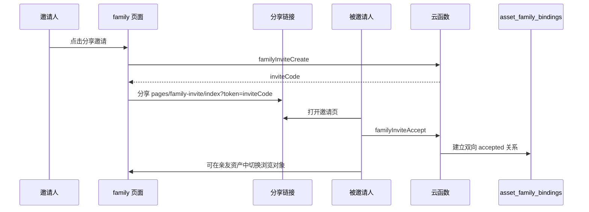
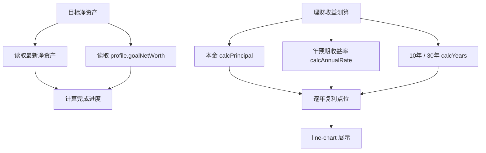
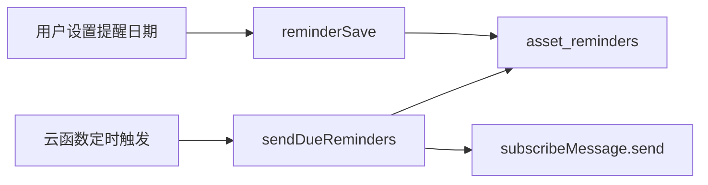

# 项目逻辑说明

本文档用于说明这款微信小程序的产品逻辑、页面结构、数据流、计算口径和云开发设计。后续改代码前，应先阅读本文档和 `README.md`，确认改动不会破坏既有统计口径。

## 1. 产品定位

这是一款面向个人和亲友协作的资产快照小程序。用户手动录入银行卡、理财、微信、支付宝、公积金、信用卡等资产信息，小程序按“记录日期”生成资产快照，并基于最新记录和可选对比记录计算净资产、负债、变化趋势和目标进度。

核心原则：

- 只做手动录入，不自动同步银行、微信、支付宝或理财账户。
- 开发、本地调试、生产环境都使用云函数和云数据库，不使用本地存储作为数据源。
- 金额统一按人民币 CNY 计算。
- 趋势图按用户实际录入日期展示，不提供日、周、月切换。
- 增加为红色，减少为绿色。
- 隐私模式开启后，前端金额默认以 `****` 展示。

## 2. 信息架构

```mermaid
flowchart TD
  A["资产总览"] --> A1["净资产、总负债、资产账户"]
  A --> A2["净资产构成：列表 / 图表"]
  A --> A3["净资产趋势"]
  B["资产明细"] --> B1["六类大资产入口"]
  B --> B2["资产 / 负债统计"]
  C["资产详情"] --> C1["记录趋势"]
  C --> C2["按日期分组的资产记录历史"]
  C --> C3["新增 / 编辑资产记录"]
  D["资产目标"] --> D1["目标净资产"]
  D --> D2["理财收益测算"]
  E["我的"] --> E1["微信头像昵称"]
  E --> E2["隐私模式"]
  E --> E3["记录提醒"]
  E --> E4["亲友资产"]
  F["亲友资产"] --> F1["分享邀请"]
  F --> F2["切换浏览对象"]
  G["云函数 snapshots"] --> G1["资产快照"]
  G --> G2["用户资料"]
  G --> G3["亲友关系"]
  G --> G4["提醒配置"]
```



## 3. 页面职责

| 页面 | 路径 | 职责 |
|---|---|---|
| 资产总览 | `pages/dashboard/index` | 展示最新净资产、总负债、资产账户数、净资产构成和净资产趋势 |
| 资产明细 | `pages/assets/index` | 展示六类大资产，支持点击大类进入详情，子分类不单独编辑 |
| 资产详情 | `pages/category-detail/index` | 六类资产共用详情页，展示记录趋势、按日期分组的历史记录、编辑人 |
| 新增资产 | `pages/record/index` | 新增或编辑某类资产记录，保存到指定记录日期 |
| 资产目标 | `pages/analytics/index` | 设置目标净资产，展示目标进度；进行 10 年 / 30 年复利测算 |
| 我的 | `pages/profile/index` | 展示微信头像昵称、隐私设置、记录提醒入口、亲友资产入口、返回我的资产 |
| 记录提醒 | `pages/reminder/index` | 设置每月几号提醒，默认当天 10:00 发送订阅通知 |
| 亲友资产 | `pages/family/index` | 分享邀请、展示绑定用户、切换亲友资产浏览模式 |
| 亲友邀请 | `pages/family-invite/index` | 接收分享 token，确认后建立双向亲友关系 |

## 4. 页面跳转图



底部 tabBar 包含：

- `资产总览`
- `资产明细`
- `资产目标`
- `我的`

## 5. 资产分类

| 分类 key | 名称 | 是否负债 | 主要字段 |
|---|---|---:|---|
| `bank` | 银行卡 | 否 | 银行名称、卡类型、尾号、当前余额、备注 |
| `wealth` | 理财 | 否 | 理财名字、金额、备注 |
| `wechat` | 微信 | 否 | 账户名称、金额、备注 |
| `alipay` | 支付宝 | 否 | 账户名称、金额、备注 |
| `housingFund` | 公积金 | 否 | 账户名称、缴存城市、账户类型、当前余额、备注 |
| `creditCard` | 信用卡 | 是 | 信用卡名称、尾号、账单日、还款日、欠款金额、备注 |

分类配置位于：

```text
miniprogram/utils/categories.js
```

颜色、标题、字段列表和是否负债都由该文件统一定义。

## 6. 核心统计口径

资产统计由 `miniprogram/utils/asset.js` 负责。



计算规则：

| 指标 | 口径 |
|---|---|
| 总资产 | 银行卡 + 理财 + 微信 + 支付宝 + 公积金，不包含信用卡 |
| 总负债 | 信用卡欠款合计 |
| 净资产 | 总资产 - 总负债 |
| 负债率 | 总负债绝对值 / (总负债绝对值 + 总资产) |
| 分类变化 | 最新记录分类金额 - 对比记录分类金额 |
| 净资产变化 | 最新记录净资产 - 对比记录净资产 |
| 趋势图 | 每个点代表一次手动录入记录 |

注意：

- 信用卡在录入时填写正数欠款，展示时按负债语义处理。
- 隐私模式下，负债前面的负号也不展示，只显示 `****`。
- 首页“净资产构成”中的列表和图表使用同一批分类数据，避免比例口径不一致。

## 7. 记录日期和对比逻辑

每次保存都会形成或更新一个按 `recordDate` 归档的资产快照。



对比记录逻辑：

- 首页、资产明细、资产详情顶部使用 `record-strip` 组件。
- `record-strip` 展示“最新记录”和“对比记录”。
- 对比日期通过下拉选项选择。
- 对比日期只保存在当前页面运行时内存中，不跨页面同步，也不保存到云端用户资料。
- `buildBundle(records, compareDate)` 使用当前页面选中的对比记录计算变化；未选择时使用默认对比记录。

新增资产记录逻辑：

- 新增某类资产时，页面会从历史资产快照中提取同类账户作为下拉选项。
- 选择历史账户后，自动填充该账户除金额和备注以外的基础信息。
- 选择“新增”或没有历史账户选项时，继续使用空白 / 默认表单手动录入。

## 8. 资产详情历史逻辑

资产详情页按日期倒序展示“资产记录历史”。



交互要求：

- 每个日期分组可以展开或收起。
- 资产记录历史按日期分页展示，首屏加载 12 个日期分组，页面下滑触底后继续加载下一页。
- 展开箭头使用 CSS 实现，展开时旋转 180 度。
- 历史记录行支持点击编辑，但不展示单独编辑按钮。
- 历史中展示编辑人，亲友模式下也记录实际编辑人。

## 9. 云端数据流

所有页面读取数据时都会走云函数：



`fetchWorkspace` 会返回：

- 当前登录用户 `openid`
- 登录用户资料 `profile`
- 当前浏览资产所属人 `viewingOwner`
- 是否正在浏览亲友资产 `isViewingFamily`
- 亲友列表 `familyMembers`
- 提醒配置 `reminder`
- 当前浏览对象的资产快照 `snapshots`

## 10. 云数据库集合

| 集合 | 用途 | 关键字段 |
|---|---|---|
| `asset_snapshots` | 按日期保存资产快照 | `ownerOpenid`, `recordDate`, `assets`, `lastEditor` |
| `asset_user_profiles` | 用户资料和偏好 | `openid`, `nickName`, `avatarUrl`, `privacyEnabled`, `activeOwnerOpenid` |
| `asset_family_bindings` | 亲友资产授权关系 | `viewerOpenid`, `ownerOpenid`, `status` |
| `asset_family_invites` | 分享邀请 token | `ownerOpenid`, `code`, `status` |
| `asset_reminders` | 每月记录提醒 | `openid`, `enabled`, `dayOfMonth`, `hour`, `minute` |

建议索引：

- `asset_snapshots`：`ownerOpenid + recordDate`
- `asset_user_profiles`：`openid`
- `asset_family_bindings`：`viewerOpenid + ownerOpenid + status`
- `asset_family_invites`：`code + status`
- `asset_reminders`：`openid`、`enabled + dayOfMonth + hour`

## 11. 云函数动作

云函数统一入口：

```text
cloudfunctions/snapshots/index.js
```

| action | 作用 |
|---|---|
| `login` | 初始化或获取当前用户资料 |
| `workspace` | 获取完整工作区数据 |
| `profileUpdate` | 更新头像、昵称、隐私和目标参数 |
| `list` | 读取当前或指定授权用户的快照列表 |
| `get` | 读取指定日期快照 |
| `upsert` | 新增或更新指定日期快照 |
| `delete` | 删除指定日期快照 |
| `replaceAll` | 替换全部快照，主要用于迁移或调试 |
| `familyInviteCreate` | 创建亲友邀请 token |
| `familyInviteAccept` | 接受亲友邀请并建立双向关系 |
| `setActiveOwner` | 切换当前浏览的资产所属人 |
| `reminderSave` | 保存每月提醒日期 |
| `sendDueReminders` | 定时发送订阅提醒 |

## 12. 亲友资产模式

亲友资产模式允许用户查看并编辑绑定用户的资产数据。



运行规则：

- 亲友关系是双向的：双方都可以在列表中看到对方。
- 切换浏览对象后，除“我的”页面外，其它页面底部显示浮层提醒：正在查看某某的资产数据。
- 亲友浏览模式下也允许新增和编辑资产。
- 保存资产时记录实际编辑人：`editorOpenid`, `editorName`, `editorAvatarUrl` 和快照上的 `lastEditor`。
- “我的”页面始终展示登录用户自己的资料，并提供“返回我的资产”按钮。

## 13. 隐私模式

隐私设置位于“我的”页面，保存到 `asset_user_profiles.privacyEnabled`。

开启后：

- 页面金额、变化值、百分比默认显示为 `****`。
- 图表纵轴和 tooltip 也显示 `****`。
- 负债金额不展示前置负号。
- 隐私遮罩只影响前端展示，不改变云端原始金额。

核心函数：

- `maskBundle`
- `maskRows`
- `maskHistoryGroups`

## 14. 资产目标

资产目标页包含两个模块。



目标参数保存在 `asset_user_profiles`：

- `goalNetWorth`
- `calcPrincipal`
- `calcAnnualRate`
- `calcYears`

复利测算公式：

```text
第 n 年资产 = 本金 * (1 + 年预期收益率 / 100) ^ n
```

## 15. 记录提醒

用户可以设置每月几号提醒，固定在该日早上 10:00 发送订阅通知。



注意：

- 日期限制在 1 到 28 号，避免不同月份天数导致异常。
- 模板 ID 需要分别配置在：
  - `miniprogram/utils/config.js`
  - `cloudfunctions/snapshots/index.js` 的 `REMINDER_TEMPLATE_ID`

## 16. 组件说明

| 组件 | 路径 | 用途 |
|---|---|---|
| `record-strip` | `components/record-strip` | 最新记录 / 对比记录固定顶部组件 |
| `donut-chart` | `components/donut-chart` | 资产构成环形图 |
| `line-chart` | `components/line-chart` | 净资产趋势、分类趋势、收益测算曲线 |
| `skeleton-screen` | `components/skeleton-screen` | 首次加载骨架屏 |

图表均为原生 canvas 实现，不使用 `echarts-for-weixin`。

## 17. 关键开发约束

后续开发请遵守：

- 不引入本地存储作为数据源。
- 不恢复 `echarts-for-weixin`，除非产品明确改口径。
- 页面标题使用小程序页面配置 `navigationBarTitleText`。
- 底部菜单使用原生 `tabBar`。
- 云函数是所有环境的数据入口。
- 资产统计口径必须与本文档和 `README.md` 保持一致。
- 如新增集合、字段或索引，必须同步更新 `README.md` 和本文档。
- 如新增页面或改变流程，必须同步更新页面职责表和信息架构图。

## 18. 常见改动入口

| 需求 | 优先查看 |
|---|---|
| 改统计口径 | `miniprogram/utils/asset.js` |
| 改分类字段或颜色 | `miniprogram/utils/categories.js` |
| 改云端读写 | `miniprogram/utils/store.js`、`cloudfunctions/snapshots/index.js` |
| 改首页 | `miniprogram/pages/dashboard` |
| 改资产详情 | `miniprogram/pages/category-detail`、`miniprogram/pages/record` |
| 改目标页 | `miniprogram/pages/analytics` |
| 改我的页 | `miniprogram/pages/profile` |
| 改亲友资产 | `miniprogram/pages/family`、`miniprogram/pages/family-invite` |
| 改提醒 | `miniprogram/pages/reminder`、`cloudfunctions/snapshots/index.js` |

## 19. 发布前检查

建议每次提交前执行：

```bash
find miniprogram cloudfunctions -path '*/node_modules/*' -prune -o -name '*.js' -print | while read file; do node --check "$file" || exit 1; done
find miniprogram cloudfunctions -path '*/node_modules/*' -prune -o -name '*.json' -print | while read file; do node -e "JSON.parse(require('fs').readFileSync(process.argv[1], 'utf8'))" "$file" || exit 1; done
```

如果使用 Codex 内置 Node，可替换为当前环境的 Node 路径。
